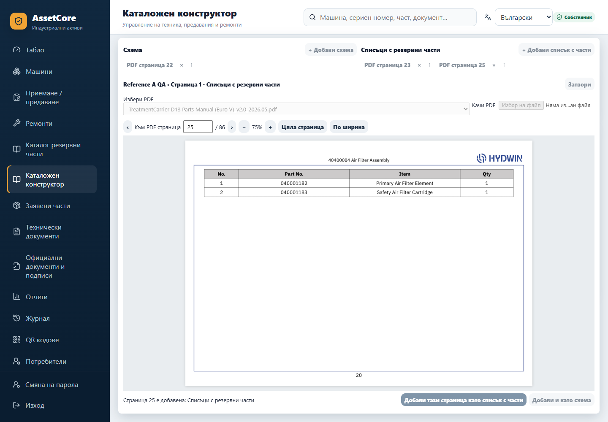
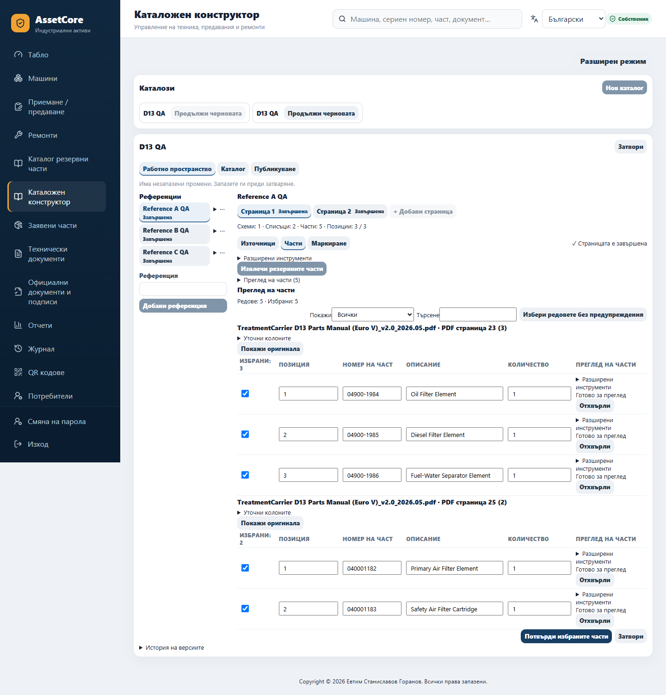
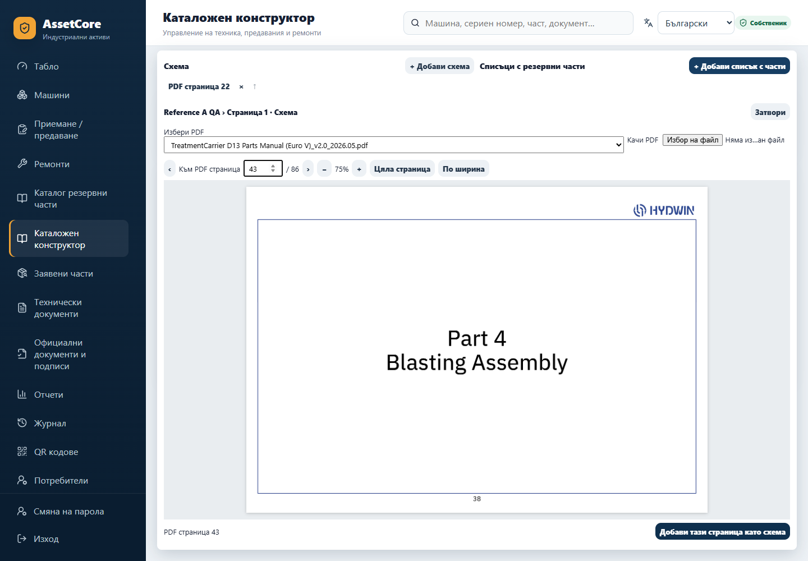
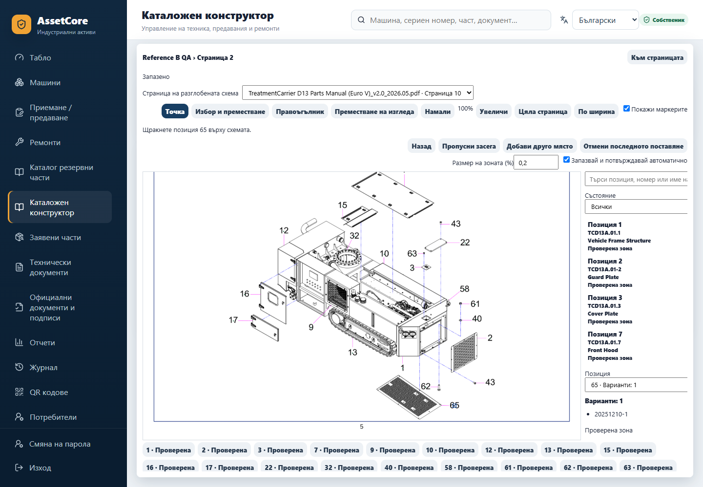
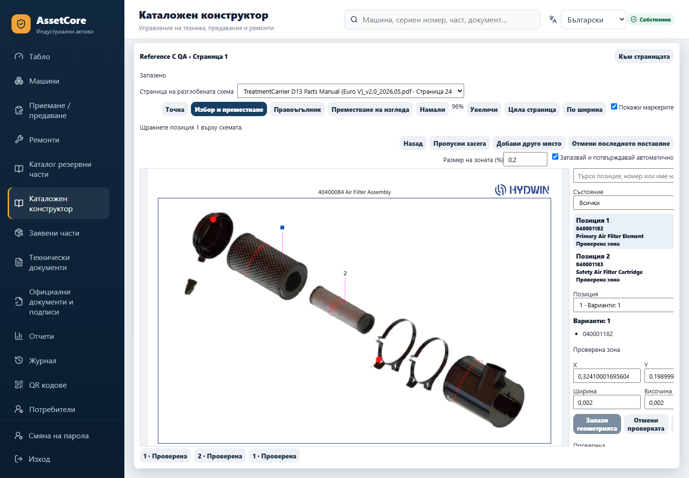
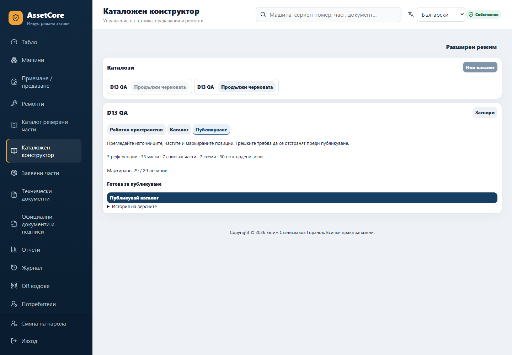
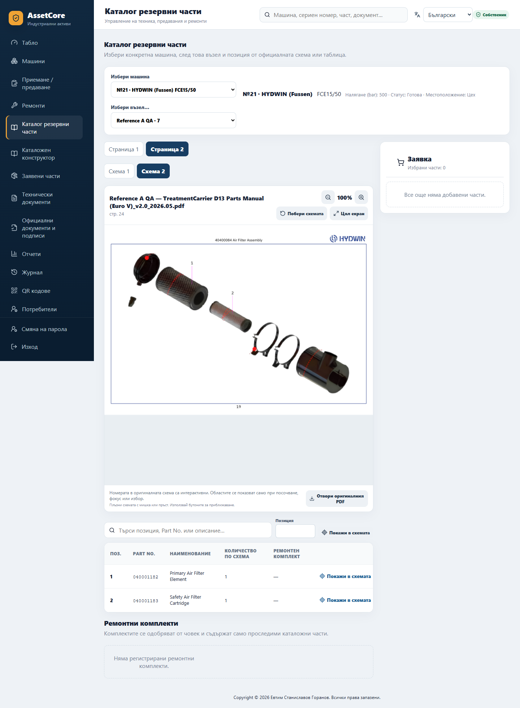
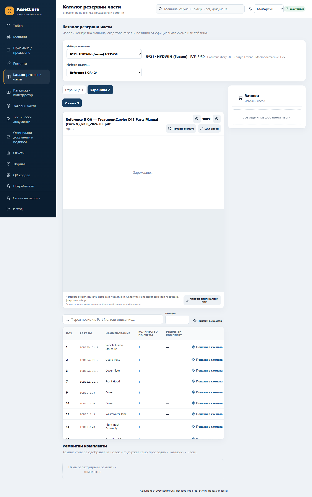
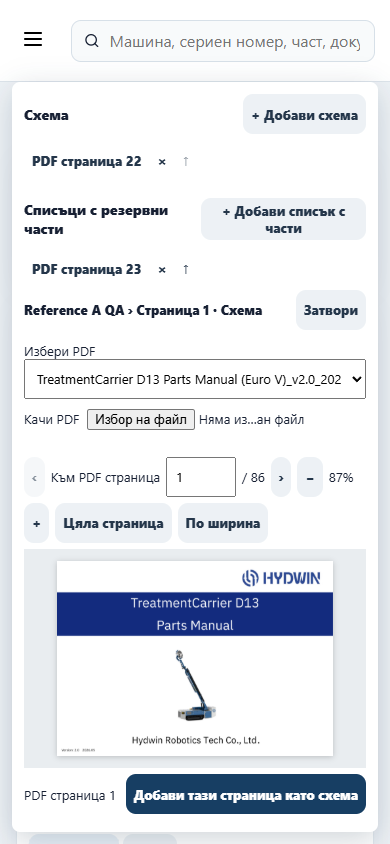
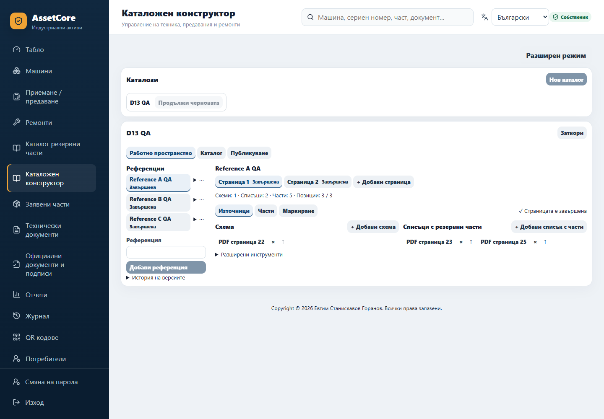

# CATALOG-BUILDER-UX-01 — отчет за реализацията и проверките

1. **PR:** [#97](https://github.com/djebedaq/AssetCore/pull/97). Остава отворен; merge и deployment не са извършвани.
2. **Заглавие:** `CATALOG-BUILDER-UX-01: Redesign reference workflow, PDF selection and precision mapping`.
3. **Авторитетна база:** `f711f6113e84fe6299b208ae8d2037b04d87968f`; началният fetch и базата на PR потвърждават същия SHA.
4. **Проверен код:** `fb6b394bdea07cc23ef83cce64d2fb56a175f730`. Крайният HEAD включва и отделния commit с този отчет и визуалните доказателства; точният HEAD се вижда в PR и в отговора за предаването.
5. **Commits:** `cb7e3349e3c1fc59c691d90e8ad23fcceed84a35` — `Redesign Catalog Builder around reference pages and precise PDF mapping`; `fb6b394bdea07cc23ef83cce64d2fb56a175f730` — `Open draft workspace on sources after catalog review`; отделен commit добавя този отчет и QA доказателствата.
6. **Обща промяна:** постоянен работен изглед с компактни референции, логически страници и местни задачи; големият PDF/чертеж получава основното пространство.
7. **Референции:** левият списък отваря конкретна референция и показва състоянието ѝ. Добавяне, преименуване, подреждане и допустимо изтриване остават достъпни; вторичните операции са в компактно меню.
8. **Логически страници:** видими табове със състояние и добавяне на страница. „Източници“, „Части“ и „Маркиране“ работят в същата избрана страница. Прегледът на каталога запазва контекста на работното пространство. Контролите се заключват, докато новата страница се създава, за да не се отвори старият ѝ контекст. Нова чернова от публикуван каталог започва с „Източници“, включително когато е отворена от глобалния преглед; това е проверено с два компонентни теста и реален compiled UI.
9. **Добави схема:** отваря четимия PDF преглед с намерение „Схема“. Главният бутон присвоява текущата физическа страница като схема; абстрактна отметка за ролята не е необходима.
10. **Добави списък с части:** същият преглед се отваря с намерение „Списъци с резервни части“. Присвоява само текущата физическа страница към тази роля.
11. **PDF преглед:** предишна/следваща страница, физически номер и общ брой, директен скок с Enter/напускане на полето, увеличение, намаляване, цяла страница, ширина и преместване на изгледа. Източникът се избира или качва без напускане на страницата. Прегледът остава отворен след присвояване.
12. **Възпроизведена причина за PDF отказ:** старият изглед заявяваше до осем миниатюри едновременно. Backend ограничава native PDF процесите до два и отхвърля останалите с `409 catalog_extraction_busy`. При реалния локален експеримент две заявки върнаха `200 image/png`, шест — `409 application/json`. Това е доказана локална причина; production логове не са използвани и не се твърди, че са проверени всички production откази.
13. **Корекция:** обща последователна опашка за прегледите и зареждане само на текущата страница. Проверява се image media type; остарели резултати и демонтирани прегледи освобождават object URL. Има видима грешка и „Опитайте отново“, включително при грешка в декодирането. Четимият backend preview вече е до 144 DPI при запазен лимит от 4 милиона пиксела; миниатюрите запазват отделния си малък бюджет.
14. **Големи ръководства:** няма предварително декодиране на целия документ. Реално са проверени ръководства с 86 и 116 страници, а компонентният тест разглежда 120 страници чрез пет preview заявки. Остарялата заявка не може да замени текущия преглед; тестовете проверяват освобождаването на URL при навигация.
15. **Няколко схеми:** текущата страница може да добавя поредни физически схеми; маркирането превключва между тях, без да създава допълнителни логически страници.
16. **Няколко списъка:** извличането обработва избраните списъци последователно и запазва точния физически произход. Браузърната проверка включва извличане от две различни физически страници.
17. **Двойна роля:** след първото присвояване се предлага вторичен бутон „Добави и като…“. Реално беше добавена и безопасно премахната допълнителната роля на страница 25 преди използването ѝ за извличане.
18. **Обобщение на източниците:** компактни групи по роля с физически номера, отваряне на точната страница, име на файла в tooltip, пренареждане и потвърдено премахване. Разпознаването използва SHA на общия PDF, защото backend създава различни artifact aliases за различни референции. Това беше открито в браузъра и е покрито с отделен тест.
19. **Преглед на части:** основните колони са позиция, номер, описание и количество; техническите полета са под „Разширени инструменти“. Показват се всички редове по подразбиране, а проблемните редове са подчертани. Няма промяна на оригиналните описания на частите.
20. **Ръчно съпоставяне:** запазени са действителните примерни клетки, изборът на колонни роли и повторното прочитане. Съществуващият тест за двусмислени колони остава в успешния frontend набор. Backend извличането остава по избрани страници и изисква човешко потвърждение.
21. **Маркери:** премахнати са постоянните надписи върху оригиналния чертеж и големият визуален minimum. Позицията се вижда в страничния списък, tooltip и достъпното име. Има скриване на маркерите, търсене, избор, още едно място, отмяна на последното поставяне и автоматично преминаване към следващата немаркирана позиция.
22. **Най-малък проверен размер:** `width=0.002`, `height=0.002`, тоест 0,2% по всяка ос. Реалната видима ширина беше 2 CSS пиксела в проверения desktop изглед. Запазен е авторитетният server/database минимум `0.002`; не е променяна геометричната семантика.
23. **Избор на малък маркер:** невидим hit target от поне 18×18 пиксела, избор от списъка и клавиатура. В режимите за нова точка/правоъгълник overlays пропускат pointer събитията, за да не пречат на близки нови позиции. В режим „Избор и преместване“ взаимодействието отново е активно. Проверено е избиране извън малката видима граница и клавиатурно преместване със запазване.
24. **Правоъгълник:** реално създаден около печатна позиция, свит от приблизително 3% до 0,2% чрез resize handle, избран и преместен с клавиатура. Числовите нормализирани координати и размери могат да се редактират и запазват. Поддържат се няколко occurrences на една позиция.
25. **Чертеж:** разширен работен панел с видим контекст и „Към страницата“, голям viewport и тесен списък с позиции. Контролите са компактни; дългият списък се превърта без припокриване. Responsive правилата увеличават touch контролите и подреждат зоните при по-малка ширина.
26. **Заменени компоненти/потоци:** преработени са `SimpleCatalogBuilder`, `GuidedWorkspace`, `GuidedSources`, `GuidedParts` и `RevisionHotspotEditor`; добавени са `SourcePageViewer` и общият `usePagePreview`.
27. **Премахнат frontend код:** глобалният номериран wizard, неговите предишна/следваща стъпка, thumbnail bulk preselection, role checkboxes, дублираните image-loading effects и неизползваният `steps` export. Запазени са разрешените advanced/fallback инструменти и backend endpoints.
28. **CSS:** заменени са thumbnail choice/grid правилата, големите hotspot размери и wizard progress/navigation правилата. Добавени са workspace density, source chips, PDF viewport, компактна таблица, отделни interaction targets и responsive разположение. Корекцията на canvas image sizing и дългия списък с позиции е проверена с реални screenshots.
29. **Преводи:** новите workspace ключове имат пълен BG/EN/RU паритет; директно заменените неизползвани source/assignment ключове са премахнати във всички три езика. React текстовете използват преводните ключове.
30. **Реален браузърен сценарий:** Edge/Chromium, 1440×1000, истински frontend и backend, реален upload, browser cookies и принудителна собствена смяна на началната QA парола. Каталогът, трите референции, петте страници, всичките източници, извличането, потвърждаването, маркирането, QA публикацията и свързването с копие на проверена seed машина са създадени през нормалния UI. Runtime проверява правилни части, логическа страница и превключване на схеми. Паролите са генерирани само в паметта; не са записвани в тестовия код или доказателствата.
31. **Видимо декодирани PDF страници:** D13 — 1, 10, 11, 22, 23, 24, 25, 43, 85 и 86; X25 — 1, 58 и 116. Финалните доказателства включват 40 успешни preview отговора `200 image/png` и реални `HTMLImageElement.decode()` проверки. Няма mock на този HTTP/blob/image път.
32. **Точни QA комбинации:** таблицата по-долу. Това е временна QA структура, която проверява роли, варианти и scoping; не е одобрен производствен D13 каталог. Оригиналните номера и описания идват от предоставеното ръководство. QA базите и binding-ите са изолирани; не се добавят в committed или production база.
33. **Визуален преглед:** screenshots на PDF, selected sources, parts review, dense mapping, малък правоъгълник, Review/Publish, runtime и повторно отворена чернова. Проблемите с canvas sizing, дългия списък и бързото добавяне на нова страница са коригирани и сценарият е повторен. PDF панелът е визуално проверен при 1280×800, 900×900 и 390×844, без хоризонтално излизане на документа. Изображенията са в [QA доказателствата](qa/catalog-builder-ux01/).
34. **Frontend:** последният пълен локален run е **55 файла / 554 успешни теста**, чрез `node frontend/node_modules/vitest/vitest.mjs run --root frontend --maxWorkers=1`. Frontend CI на `fb6b394` също е успешен. Един междинен run имаше timing отказ в непроменен `MachineEntryActions` тест; последният пълен run премина без промяна на този тест. Новите проверки покриват роли, навигация, multi-source/dual-role, alias SHA, безопасно премахване, preview retry, URL cleanup, паритет, заключване при създаване на страница и началната задача при отваряне на чернова.
35. **Пълен backend:** [CI run 37105278052](https://github.com/djebedaq/AssetCore/actions/runs/37105278052) премина `python -m pytest -q -m "not postgres" --durations=10`: **1115 passed, 3 skipped, 61 deselected**, без failed/errors. Двете пропуснати LibreOffice проверки са компенсирани от локалния Docker набор с наличен LibreOffice; Windows mutex проверката е изпълнена на Windows: **1 passed**. Локалният пълен Linux run завърши с **1100 passed, 1 skipped, 61 deselected, 17 errors**; всички 17 errors бяха от липсващ Git в QA образа. Целият `tests/test_production_manager.py` е повторен в коригиран образ: **157 passed, 1 skipped**. Това са отделни резултати, не фиктивен успешен общ локален run. Backend кодът е еднакъв в `cb7e334` и `fb6b394`. Assertion-ите, locks и gates не са отслабени; прекъснатите ранни runs не се броят за успешни.
36. **PostgreSQL:** пълният CI набор срещу PostgreSQL 16 е **61 passed**, включително реалните overlapping transactions, migrations и encrypted backup/restore. Локалният завършен повторен `python -u -m pytest -q tests/postgres --tb=short --durations=10` даде **60 passed, 1 failed**: lock timeout при едновременно генериране на протоколи. Същият случай е повторен отделно с непроменени assertions/timeouts: `python -u -m pytest -q tests/postgres/test_concurrency.py::test_two_parts_protocol_generations_create_one_canonical_document --tb=short --durations=10` — **1 passed**. Ранният опит със затворен QA cluster не се брои за успешен. Изолираните локални clusters са премахнати; production база не е използвана.
37. **Статични проверки:** успешни `pnpm --dir frontend typecheck`, `pnpm --dir frontend lint`, `pnpm --dir frontend build`, `.venv/Scripts/python.exe -m ruff check backend/app backend/alembic backend/scripts scripts tests`, `.venv/Scripts/python.exe -m compileall -q backend/app backend/alembic backend/scripts scripts tests`, `.venv/Scripts/python.exe -m pip check`. CI изпълнява същите Python проверки със своя interpreter. Build има съществуващото предупреждение за bundle над 500 kB. Migration history: 31 protected migrations, без липсващи/изменени; authorization, catalog-v2 и translation gates са успешни. Dependency audit: нула блокиращи находки; две MODERATE Vitest находки във frontend отчета, без Python находки. Dependency lockfiles не са променени.
38. **Docker / offline OCR / release:** локалният `docker build --build-arg ASSETCORE_RELEASE_SHA=cb7e3349e3c1fc59c691d90e8ad23fcceed84a35 --tag assetcore:catalog-builder-ux01-final .` премина. Целият 33-part browser сценарий е повторен върху неговите компилиран frontend и реален backend. Малката последваща frontend поправка е проверена в QA overlay образ със свежия `frontend/dist`; в него нормалният UI създаде/публикува QA каталог и отвори нова чернова с видими „Източници“. Стандартният Docker CI build/runtime на основната реализация е успешен, включително fixed non-root identity, read-only LibreOffice, offline Tesseract OCR, health/readiness, PG16 encrypted round trip и реален PG17 rejection. `python scripts/verify_release.py --output release-verification` премина в CI; отделният локален изолиран run върху `fb6b394` премина **26/26 checks**. Overlay образът е само QA; не е публикуван или внедрен.
39. **PARTS-DOC:** пълният backend набор и отделните Docker проверки за official visual appendix и late-bound Builder документи преминаха, включително реален LibreOffice DOCX→PDF и дълъг 80-character part number. Local release QA потвърди DOCX/PDF/template/document hashes. Кодът за immutable official documents, visual snapshots и протоколи не е променян.
40. **HPWJ:** пълният backend набор и release QA преминаха; release verifier потвърди точния **19-machine** регистър, owner designation, четирите роли, 12 одобрени BG/EN/RU template версии и **611** verified source реда. Catalog-v2 validation потвърди **9/9** неизменени авторитетни source fingerprints и translation gate за каноничните записи. Verified seed и source register не са променяни.
41. **Ограничения:** авторската end-to-end проверка е desktop, не пълна touch-device приемка; при малките размери е проверен PDF панелът. Много голям zoom е ограничен от 144 DPI/4M pixel render budget. Production preview traces не са използвани. Оригиналните OEM PDF файлове остават controlled reference material извън commit-ите. Потвърждението на OCR/извлечени части остава човешко.
42. **Whole-document auto-ingest:** не е възстановяван. Не са добавени automatic grouping, page-role guesses, scheme/BOM pairing или trusted generated hotspots.
43. **Външен AI:** няма добавени external/paid AI, cloud OCR или платени APIs. Native PDF render и OCR остават локални.
44. **Legacy cleanup:** не е извършван широк backend/legacy cleanup; отстранен е само frontend кодът, директно заменен от този redesign.
45. **Production и бизнес материал:** production workspace и база не са използвани или променяни; не са правени build, migration, restart или deployment в production инсталацията. Docker образите са изградени само в development/QA и CI. Прегледът на diff не показва промени в verified seed, source register, оригинални DOCX/PDF, migration история или съществуващи audit/document records. Новите PNG са изрично QA screenshots.
46. **Предаване:** PR е отворен и unmerged; предава се за независим review и последващия production acceptance test от потребителя. Merge и deployment не са извършвани.

| QA референция | Логическа страница | Физически схеми | Физически списъци | Части | Различни позиции | Потвърдени маркери |
|---|---:|---|---|---:|---:|---:|
| Reference A QA | 1 | 22 | 23, 25 | 5 | 3 | 3 |
| Reference A QA | 2 | 22, 24 | 25 | 2 | 2 | 2 |
| Reference B QA | 1 | 22, 24 | 23, 25 | 5 | 3 | 3 |
| Reference B QA | 2 | 10 | 11 | 19 | 19 | 19 |
| Reference C QA | 1 | 24 | 25 | 2 | 2 | 3 |
| Общо | 5 | 7 | 7 | 33 | 29 | 30 |

Сценарият може да се повтори чрез export-ите в [реалния browser test](../tests/browser/catalog_builder_ux.mjs). Caller-ът предоставя вече автентикирана изолирана QA страница, Playwright `expect`, действителното D13 ръководство, output директория и проверена seed машина за временния QA binding. Credentials, оригинални PDF файлове и QA бази не са част от fixture-а.

Допълнителните gates в успешния CI са изпълнени с тези команди:

| Проверка | Команда | Резултат |
|---|---|---|
| Migration history | `python backend/scripts/validate_migration_history.py --require-all-protected` | PASS — 31 protected migrations |
| Authorization inventory | `python backend/scripts/validate_authorization_inventory.py` | PASS |
| Catalog-v2 | `PYTHONPATH=backend python backend/scripts/catalog_v2_validation.py` | PASS — 9/9 source fingerprints |
| Catalog translations | `PYTHONPATH=backend python backend/scripts/build_catalog_translations.py --check` | PASS |
| Deployment configuration | `python -m pytest -q tests/test_runtime_deployment_hardening.py` | PASS |
| Frontend security | `python3 scripts/audit_dependencies.py frontend --output security-reports/frontend-audit.json` | PASS — нула блокиращи, 2 moderate |
| Python security | `python scripts/audit_dependencies.py python --output security-reports/python-audit.json` | PASS — без находки |
| Release | `python scripts/verify_release.py --output release-verification` | PASS |

Основната реализация има успешни четири jobs в [run 289](https://github.com/djebedaq/AssetCore/actions/runs/37105278052). Последващият commit променя само началната frontend задача и добавя два frontend теста; backend, PostgreSQL, Dockerfile и dependencies са идентични. [Run 290](https://github.com/djebedaq/AssetCore/actions/runs/37106937083) проверява този commit; неговите frontend, PostgreSQL и стандартен Docker build/runtime вече са успешни. При записването на отчета повторният backend job още работи; успешният пълен backend резултат по-горе е от run 289. Пълният локален frontend набор и compiled UI regression са върху `fb6b394`. Commit-ът само с отчета/изображенията може да задейства нов автоматичен CI run; неговият текущ статус е видим в PR, а не се представя предварително като успешен.

Компактни източници и таблица с оригиналните части:

Четим PDF и прецизно маркиране върху действителния чертеж:

Изолирана QA публикация и runtime:

Проверка на PDF панела при телефонна ширина и на нова чернова след публикация:

