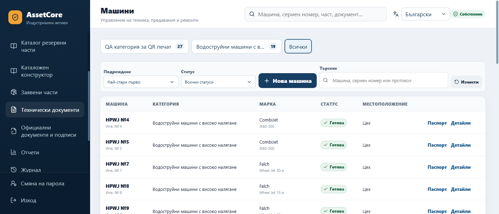
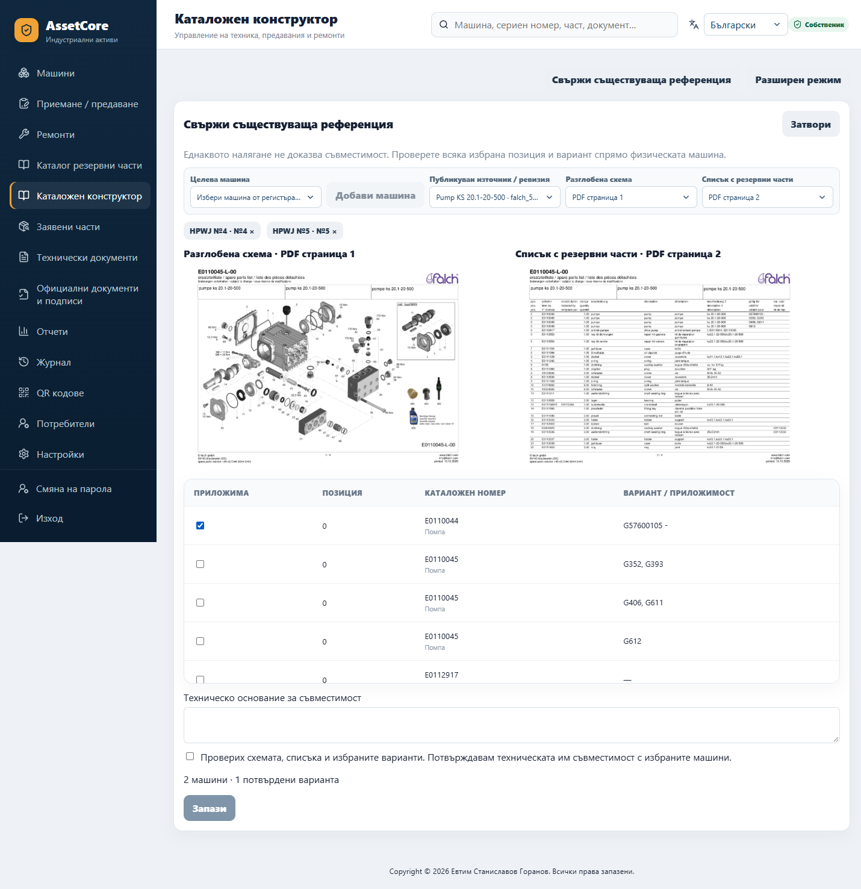

# ASSETCORE-02 — реален браузърен QA

Microsoft Edge / Chromium 155.0.4283.45, desktop 1440×900, sidebar overflow
1440×620 и mobile 390×844. Изолирана SQLite QA база с проверените 19 HPWJ
идентичности и **27 изрично синтетични QR актива само за теста**. Не е production.
Няма запазени пароли, browser storage state, HAR или trace.

[Машинночетим резултат](qa-results.json): 8 успешни групи, 17 screenshots,
без browser page errors. Проверени са реални кликове, server search, deep link,
scroll wheel, forced colors, избор на оригинални страници и конкретен вариант,
две целеви машини, изрично потвърждение, debounce и филтри, QR scope и keyboard
focus. BG/EN/RU са отворени в браузъра.

Печатът е проверен чрез Chromium print media и реален A4 PDF export: **27**
етикета от избраната QA категория при **24** на екранната страница. Всички
изображения са декодирани преди извикването на print. Native OS print dialog
не е автоматизиран. Firefox не е инсталиран/изпълняван; има стандартен CSS
fallback, но това не е отчетено като Firefox browser pass.

| Доказателство | Изглед |
|---|---|
| 01 | [Машини → Всички](01-machines-all.png) |
| 02 | [Четирите Falch идентификатора](02-falch-identities.png) |
| 03 | [Избор на съществуваща референция](03-reference-source-selection.png) |
| 04 | [Оригинална схема и spare-parts list](04-scheme-and-parts-list.png) |
| 05 | [Изрично потвърждение](05-explicit-compatibility-confirmation.png) |
| 06 | [CombiJet №4 с допълнителна референция](06-machine-shared-reference.png) |
| 07 | [Реален 7 px navy scrollbar](07-sidebar-scrollbar.png) |
| 08 | [Приемане / предаване — филтри](08-official-transfers-filters.png) |
| 09 | [Ремонти — филтри](09-official-repairs-filters.png) |
| 10 | [Заявени части — филтри](10-official-parts-filters.png) |
| 11 | [QR начални категории без изображения](11-qr-initial-categories.png) |
| 12 | [QR избрана категория](12-qr-selected-category.png) |
| 13 | [Chromium print layout — всичките 27 етикета](13-qr-print-selected-category.png) |
| 14 | [Mobile QR](14-mobile-qr.png) |
| 15 | [Mobile машини](15-mobile-machines.png) |
| 16 | [English](16-machines-en.png) / [Русский](16-machines-ru.png) |

